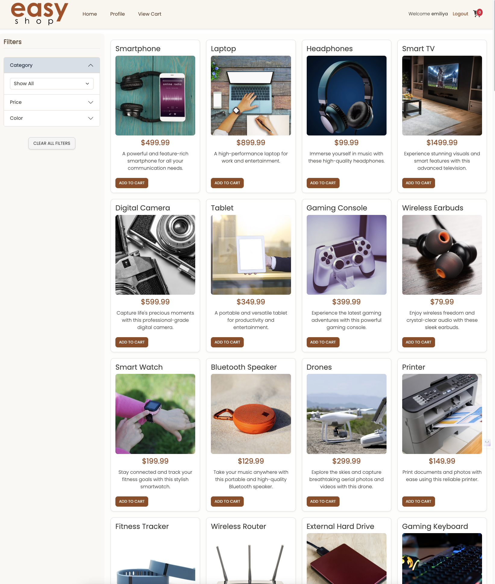
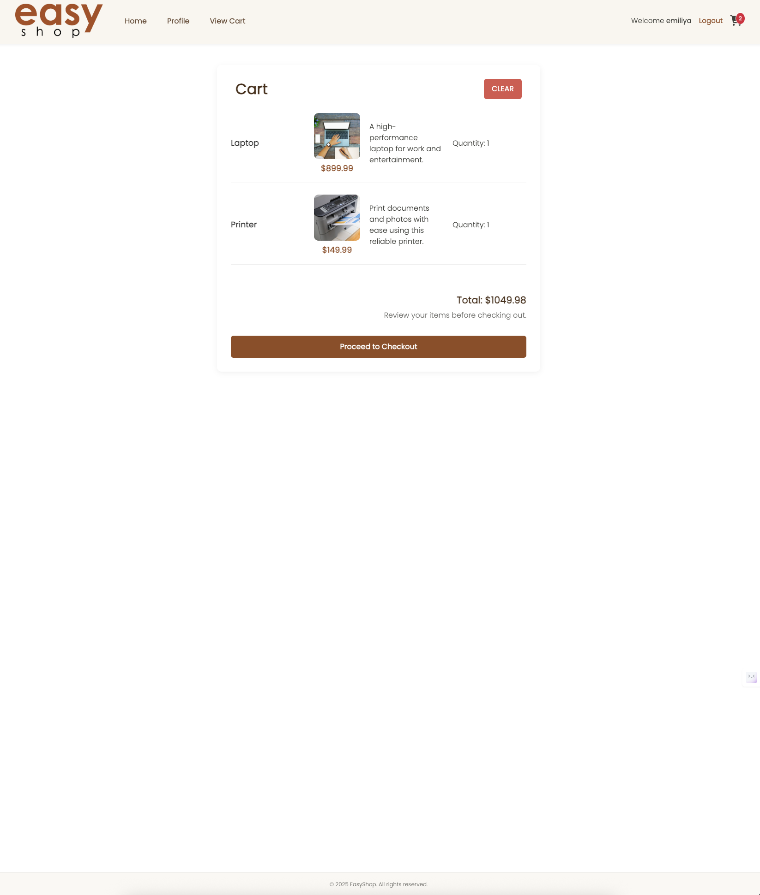
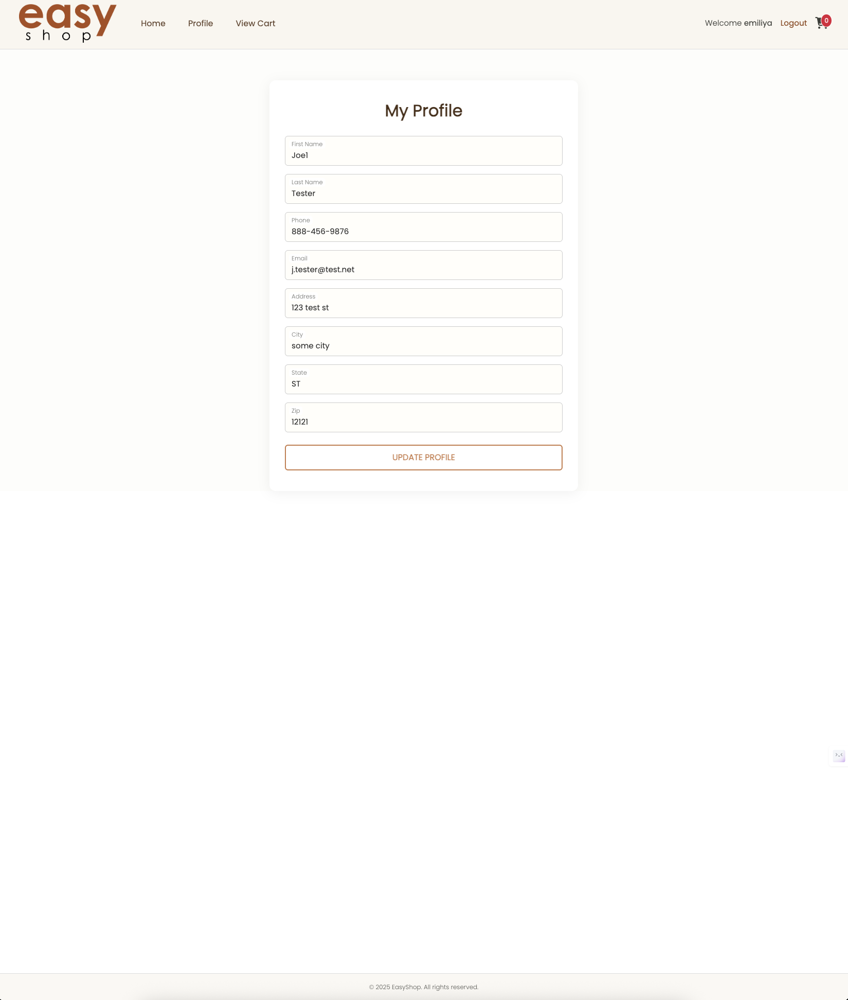

# 🛍️ EasyShop Frontend

Welcome to the **EasyShop Frontend** — a clean, modern shopping interface built with HTML, CSS, JavaScript, and Bootstrap!  
It connects seamlessly with the EasyShop Spring Boot backend to provide a full e-commerce experience.

---

## ⚙️ Running the Project

This project is **not deployed**. To run the frontend locally:

1. Clone or download this repository
2. Open the project folder in VS Code (or your code editor)
3. Right-click `index.html` and select **"Open with Live Server"**
4. Make sure the backend is running at `http://localhost:8080`
5. Start shopping! 🎉

---

## ✨ Features

- 🎨 Modern responsive UI with Bootstrap
- 🔍 Product catalog with image zoom and details
- 🛒 Add, view, and remove items from your cart
- 🧹 One-click clear cart functionality
- 👤 View and update user profile
- ✅ Checkout button creates an order through the backend
- 📦 Integrated with the EasyShop Spring Boot API

---

## 🔗 Connected API Endpoints

| Endpoint         | Method | Description                |
|------------------|--------|----------------------------|
| `/products`      | GET    | Fetch all products         |
| `/cart`          | GET    | Retrieve user’s cart       |
| `/cart/products/{id}` | POST | Add item to cart      |
| `/cart`          | DELETE | Clear cart                 |
| `/orders`        | POST   | Checkout and create order  |
| `/profile`       | GET    | View profile               |
| `/profile`       | PUT    | Update profile             |

---

## 🖼️ Screenshots

### 🏠 Home Page

### 🛒 Cart Page

### 👤 Profile Page

---

